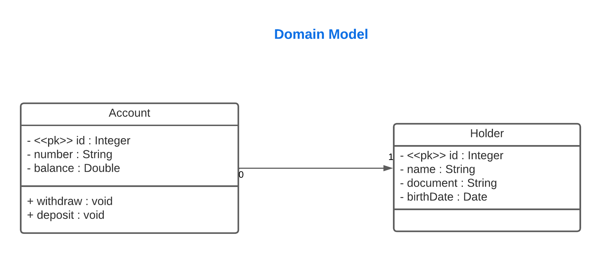
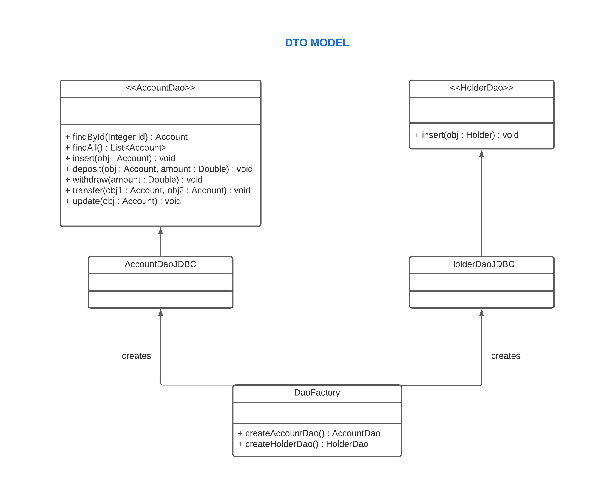

# 🔖 Sobre o projeto

O projeto **SimpleBank** é um projeto simples que foi feito com o intuito de colocar em prática o paradigma de Programação Orientada a Objetos, Driver JDBC e a design pattern DAO.

Este projeto realiza operações simples que são: cadastro de contas, depósitos, saques, transferências e listagem de todas as contas cadastradas.

---


## 📊 Abaixo está o diagrama UML das entidades do projeto 

<h1>
    
</h1>


## 📊 Diagrama do modelo DAO utilizado no projeto

<h1>
    
</h1>

## 🚀 Tecnologias utilizadas no projeto

- [Java](https://www.oracle.com/java/technologies/downloads/)
- [MySQL](https://www.mysql.com/)
- [Driver JDBC](https://www.oracle.com/br/database/technologies/appdev/jdbc.html)

---

## 📂 Como baixar o projeto


> Primeiro crie um banco de dados com o script que está dentro do arquivo DB.script, e dentro do arquivo DB.properties, ajuste as propriedades conforme o seu banco de dados.

---

```bash
    $ git clone git@github.com:douglasbello/bank-management-software.git

    $ cd bank-management-software/src/application

    $ javac Bank.java

    $ java Bank.java
```

